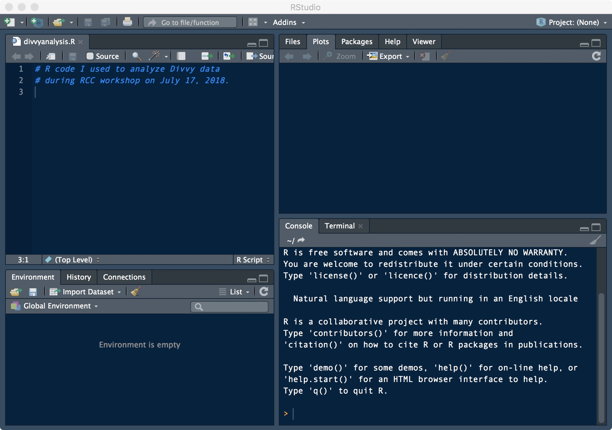

```{r knitr-options, echo=FALSE}
knitr::opts_chunk$set(comment = "#",collapse = TRUE,fig.align = "center",
                      results = "hide", fig.show = "hide", message = FALSE,
		              warning = FALSE)
```

Aims of workshop
================

1. Work through a basic data analysis in R.

2. Understand how to import data from a CSV file into an R data frame.

3. Use standard tools to summarize & manipulate data frames.

4. Learn how to install & use R packages.

5. Use ggplot2 to create plots from data frames.

6. Learn through "live coding"—this includes learning from our
   mistakes!

Our goal: Analyze Divvy data from 2016 & 2017
=============================================

+ Investigate bike sharing trends in Chicago.

+ We will use data made available from Divvy:

    - www.divvybikes.com/system-data

+ Much of the effort will be spent importing the data, inspecting the
  data, and preparing the data for analysis.

+ Once we have carefully prepared the data, creating visualizations is
  (relatively) easy.

It's your choice
================

Your may choose to...

+ Use R on your laptop.

+ Use RStudio on your laptop.

+ Use R or RStudio (Desktop or Server) on the RCC cluster.

+ Pair up with your neighbour.

+ Follow what I do on the projector.

**Note:** If you use the RCC cluster I'm assuming you know how to set
up an interactive computing session with appropriate amount of time
and memory, load R or RStudio, and display graphics (e.g., using
ThinLinc).

Software we will use today
==========================

1. **R**

2. R packages **readr**, **ggplot2** & **cowplot**.

3. **RStudio** (optional).

**Note:** I'm assuming you have already installed R and/or RStudio on
your laptop, or you are using the RCC cluster.

Outline of workshop
===================

1. Initial setup.

2. Load & prepare the Divvy station data.

3. Load & prepare the Divvy trip data.

4. Create a map of the Divvy stations.

5. Create plots comparing bike sharing in 2016 & 2017.

Initial setup
=============

+ WiFi

+ Power outlets

+ Pace, questions (e.g., keyboard shortcuts).

+ Help.

Download or "clone" git repository
==================================

Download the workshop packet to your computer.

+ Go to: [**github.com/rcc-uchicago/R-intro-divvy-2**][github-repo]

+ To download, click the green **"Clone or download"** button.

Or, if you have **git**, run this command:

```{bash download-repo, eval=FALSE}
git clone https://github.com/rcc-uchicago/
  R-intro-divvy-2.git
```

(Note the URL in the git command should not contain any spaces.)

+ *Note:* If you are using the RCC cluster, also download workshop
  packet on the cluster.

What's in the workshop packet
=============================

```
R-intro-divvy-2
  /analysis # Scripts implementing data analyses.
  /code     # Additional code used in analyses.
  /data     # Original ("raw") data.
  /docs     # Additional workshop materials.
  /output   # Processed data & results files.
```

+ This setup mimics how I typically organize the code, data and
  results for my projects.

Open the slides on your computer
================================

+ This PDF is useful for copying & pasting code from the slides.

+ The PDF is in the [**"docs"**](../docs) folder of the workshop packet.

+ You can also view the PDF by clicking the **"docs"** item in the file
  listing on the GitHub webpage.

Set up your R environment
=========================

+ Launch R or RStudio.

+ *We will run all the code from the **"analysis"** folder*.

+ To change your working directory:

    + In R, use `setwd()` function.

    + In RStudio, select **Session > Set Working Directory > Choose
      Directory...`**

Before continuing, check that you have the right working directory:

```{r check-wd}
getwd()  # Should end with "analysis".
```

Run `sessionInfo()`
===================

Check the version of R that you are using:

```{r check-version}
sessionInfo()
```

If you are using an older version of R (version 3.3 or earlier), I
strongly recommend upgrading to the latest version. *Some of the
examples may not work in older versions of R.*

Check your R environment
========================

The R environment is where all variables and functions are stored and
accessed. You should start with an empty environment. Check this:

```{r check-env}
ls()
```

If you see names of objects listed, it means your environment is
not empty, and you should restart R with a clean environment.

+ Do `rm(list = ls())`.

+ Or, in RStudio, go to **Session > Restart R**.

Create a file to keep track of your analysis code
=================================================

+ In RStudio, select **File > R Script**.

+ Alternatively, use your favourite editor (nano, emacs, vim, Atom, *etc*).

+ Add some comments to the title to remind yourself what this file is
  for, e.g.,

    ```
    # Some of the R code I wrote during the RCC
	# workshop on July 17, 2018.
    ```

+ Save the file in the [**"analysis"**](../analysis) folder.
  Name the file whatever you'd like (e.g., `divvyanalysis.R`).

The console is the "brains" of RStudio
======================================



Download the Divvy data
=======================

+ Disk space required: at least **2 GB**.

+ Download the 2016 & 2017 data files from here:

    + [**www.divvybikes.com/system-data**][divvy-data]

+ Download them to the [**"analysis"**](../analysis) folder.

+ You should have 4 ZIP files:

    ```
    Divvy_Trips_2016_Q1Q2.zip
    Divvy_Trips_2016_Q3Q4.zip
    Divvy_Trips_2017_Q1Q2.zip
    Divvy_Trips_2017_Q3Q4.zip
    ```

+ Decompress ("unzip") all of these files.

Check that you have all the files 
=================================

After unzipping, you should have **15** CSV files.

```{r list-files}
Sys.glob("*.csv")
```

*If you don't see all 15 CSV files, you have not successfully
downloaded and/or unzipped all the files in the "data" directory.*

Outline of workshop
===================

1. Initial setup.

2. **Load & prepare the Divvy station data.**

3. Load & prepare the Divvy trip data.

4. Create a map of the Divvy stations.

5. Create plots comparing bike sharing in 2016 & 2017.

Eyeball the station data in the CSV file
========================================

+ Open the CSV file **Divvy_Stations_2017_Q1Q2.csv** in RStudio, or in
  your favourite text editor (e.g., Notepad in Windows, TextEdit on
  Mac).

+ CSV is a simple and commonly used data format.

+ It is easily read into R, and read by humans.

+ Each line stores an item (station).

+ The first line is a special line called the "header".

+ Entries in each line (table row) are separated by commas.

Import the station data into R
==============================

Load the most recent station data into an R "data frame":

```{r read-station-data}
stations <- read.csv("Divvy_Stations_2017_Q3Q4.csv",
                     stringsAsFactors = FALSE)
```

This will define a new object, "stations", in your environment:

```{r inspect-station-data-1}
ls()
```

It is a "data frame" object:

```{r inspect-station-data-2}
class(stations)
```

*What does "read.csv" do, and what is a "data frame"?* R has detailed
documentation:

```{r help-readcsv-dataframe, eval=FALSE}
help(read.csv)
help(data.frame)
```

Inspect the station data
========================

Run these commands to start inspecting the station data:

```{r inspect-station-data-3}
nrow(stations)
ncol(stations)
head(stations)
tail(stations)
summary(stations)
```

Inspect the data in more detail:

```{r inspect-station-data-4}
sapply(stations,class)
print(object.size(stations),units = "Kb")
```

*What do we learn about the station data from running these
commands? Does this reveal any issues with the data?*

Take a closer look at the "dpcapacity" column
=============================================

Create a new object containing only the "dpcapacity" column:

```{r inspect-dpcapacity-data-1}
x <- stations$dpcapacity
```

Run these commands to take a closer look at the "dpcapacity" column:

```{r inspect-dpcapacity-data-2}
class(x)
length(x)
summary(x)
table(x)
```

*Did we gain any additional insight from running these commands?*

Take an even closer look at "dpcapacity"
========================================

It is interesting that a few of the Divvy bike stations are much
larger than the others, whereas others have no docks. Where are these
stations?

```{r inspect-dpcapacity-data-3}
subset(stations,dpcapacity == 0)
subset(stations,dpcapacity >= 40)
```

Alternatively, we can sort the table rows, then inspect the top and
bottom rows:

```{r inspect-dpcapcity-data-4}
rows <- order(stations$dpcapacity,decreasing=TRUE)
stations <- stations[rows,]
head(stations)
tail(stations)
```

*What was risky about line 2?*

Take a closer look at the "city" column
=======================================

Above we inspected *numeric* data. Next's, let's look at an example of
non-numeric data.

```{r inspect-city-data-1}
x <- stations$city
class(x)
summary(x)
```

The summary is not very useful here! The key is to convert to a
"factor" (factor = categorical variable):

```{r inspect-city-data-2}
x <- factor(stations$city)
class(x)
summary(x)
```

*Did you discover an issue with the data from running these commands?*

What is a "factor"?
===================

Factors are very useful. Let's take a deeper look.

```{r inspect-factor}
attributes(x)
unclass(x)
```

Improving the "city" column
===========================

Let's fix the problem we found earlier. First, select the offending
rows of the table:

```{r revise-city-data-1}
rows <- which(stations$city == "Chicago ")
```

Fix the "city" entry for the selected rows:

```{r revise-city-data-2}
stations[rows,"city"] <- "Chicago"
```

The "city" column is more useful if it is a factor, so let's convert
it:

```{r revise-city-data-3}
summary(stations)
stations <- transform(stations,
                      city = factor(city))
summary(stations)
```

There are many ways to select rows & columns
============================================

Select first 4 rows of "name" column:

```{r select-rows}
stations$name[1:4]
stations[1:4,2]
stations[1:4,"name"]
```

+ *Do you prefer one approach?*

Select  first 4 rows and multiple columns:

```{r select-columns}
stations[1:4,c(2,3,6)]
stations[1:4,c("name","city","dpcapacity")]
```

*Can rows be selected by name?*

```{r station-names}
colnames(stations)
rownames(stations)
```

Save your code & session state
==============================

It is important to periodically save:

1. your code,

2. the state of your R environment.

To save your environment, go to **Session > Save Workspace As...** in
RStudio, or run this code:

```{r save-session-1}
save.image("divvyanalysis.RData")
```

Later, to restore your environment in a new session, select **Session >
Load Workspace...** in RStudio, or run this code:

```{r load-session, eval=FALSE}
load("divvyanalysis.RData")
```

Main concepts covered so far
============================

+ The R environment & working directory.

+ Read a data frame from a text (CSV) file.

+ Tools to inspect a data frame.

+ Manipulate a data frame.

+ Factors = categorical variables.

+ Selecting & and columns.

+ Order rows of a data frame.

+ Save state of R environment.

Outline of workshop
===================

1. Initial setup.

2. Load and prepare the Divvy station data.

3. **Load and prepare the Divvy trip data.**

4. Create a map of the Divvy stations.

5. Create a scatterplot comparing bike sharing activity in 2016
   and 2017.

Import the Divvy trip data into R
=================================

Previously, we used `read.csv` to import station data into R. Let's
now use the same function to load the most recent trip data:

```{r read-trip-data}
trips <-
  read.csv("Divvy_Trips_2017_Q4.csv",
           stringsAsFactors = FALSE)
```

You may find that this command look longer to run than
before. Consider that the trips data is much larger:

```{r trip-data-size}
nrow(trips)
ncol(trips)
```

This gives an opportunity to demonstrate faster methods
for importing large data sets.

Import Divvy trip data using `readr` (optional)
===============================================

Install the **readr** package from CRAN:

```{r install-readr, eval=FALSE}
install.packages("readr")
```

Load the functions from the package into your R environment:

```{r load-readr}
library(readr)
```

Let's use the `read_csv` function from this package:

```{r read-trip-data-readr}
trips <-
  read_csv("Divvy_Trips_2017_Q4.csv",
           na = "NA")
```

*How much faster is `read_csv`?*

+ **Note:** The `na = "NA"` argument was added to reproduce behaviour of
  `read.csv`.

Import Divvy trip data using `readr` (optional)
===============================================

The `read_csv` output is *not* a data frame—it is a "tibble".

```{r check-trip-data-class}
class(trips)
```

Typically, I convert it to a data frame:

```{r convert-trip-data}
class(trips) <- "data.frame"
```

+ For more on tibbles, see:

    - http://r4ds.had.co.nz

+ The **readr** package has many other features not covered here.

+ Another fast method is `fread` from the **data.table** package.

More on packages in R
=====================

"Vignettes" are a great way to learn about a package:

```{r readr-vignette, eval=FALSE}
vignette(package = "readr")
vignette("readr")
```

+ CRAN is the official package source:

    - https://cran.r-project.org.

+ Other good places to find packages:

    - Bioconductor
    - GitHub.

+ *What packages are already installed?*
  `rownames(installed.packages())`

+ *Where do the packages live?* `.libPaths()`

+ *How to learn more about a package?* `help(package=readr)`

A first glance at the trips data
================================

Let's use some of the same commands we used earlier to quickly get an
overview of the trip data:

```{r inspect-trip-data}
nrow(trips)
ncol(trips)
head(trips)
summary(trips)
```

Unfortunately, the summary command isn't particularly informative for
many of the columns.

+ *What columns should we convert to factors?*

Convert "gender" to a factor
============================

Let's start by converting the "gender" column to a factor:

```{r convert-trip-data-1}
trips <- transform(trips,gender = factor(gender))
summary(trips$gender)
levels(trips$gender)
```

*What problem have we stumbled upon?*

Handling "missing" data
=======================

In R, "missing data" should always be assigned the special value `NA`
("not available" or "not assigned"):

```{r convert-trip-data-2}
rows <- which(trips$gender == "")
trips[rows,"gender"] <- NA
trips <- transform(trips,
                   gender = factor(gender))
summary(trips$gender)
```

Many functions in R will correctly handle missing data as long as
they are encoded as `NA`.

+ **Note:** `read_csv` automatically converts empty
  character strings to `NA`, but `read.csv` does not.

Convert "station" columns to factors
====================================

Next, let's convert the "from station" and "to station" columns to
factors:

```{r convert-trip-data-3}
trips <- transform(trips,
  from_station_name = factor(from_station_name),
  to_station_name = factor(to_station_name))
summary(trips)
```

The summary is now more informative. However, here it is better to
specify the "levels" when converting to factors:

```{r convert-trip-data-4}
x <- stations$name
trips <- transform(trips,
  from_station_name = factor(from_station_name,x),
  to_station_name = factor(to_station_name,x))
```

*Why is this important?*

Example: summarizing trips by station (optional)
================================================

Create a new data frame containing the "from" and "to" trip totals:

```{r create-trip-totals-table}
from <- table(trips$from_station_name)
to   <- table(trips$to_station_name)
tripcounts <- data.frame(from = c(from),
                         to   = c(to))
```

With this new data frame, we can easily create a scatterplot comparing
the rate of departures to arrivals at each station:

```{r trips-totals-scatterplot}
plot(tripcounts$from,tripcounts$to,pch = 20,
     panel.first = abline(a = 0,b = 1))
```

*Exercise:* Use `subset` to find the one station that has many more
departures than arrivals.

A note about dates & times
==========================

+ `summary(trips)` is also not useful for the
dates & times.

+ Processing dates & times is more complicated.

+ See `help(strptime)` and the **lubridate** package.

Main concepts covered in second part
====================================

+ Install & use a package.

+ Handle missing data (NA's).

+ Create a data frame.

+ Create a plot from a data frame.

Preparing data is tedious
=========================

Data preparation is sometimes >90% of the effort!

+ *Many analysis mistakes are due to poor data preparation.*

Common issues include:

+ Formatting mistakes in CSV file.

+ Converting table columns to the appropriate data type.

+ Entry inconsistencies (e.g., additional spaces).

+ Missing data.

+ Many other examples of Poor Practices in recording data.

(And we haven't yet dealt with merging data from multiple files—this
usually creates more headaches!)

Moving beyond data preparation
==============================

+ So far, we have illustrated a few of the challenges of working with
  large tabular data sets ("data frames").

+ In order to proceed to fun stuff, I've "hidden" some of the additional
  complications—I wrote a function in R to import and merge all the
  Divvy data into a single data frame.

Outline of workshop
===================

1. Initial setup.

2. Load & prepare the Divvy station data.

3. Load & prepare the Divvy trip data.

4. **Create a map of the Divvy stations.**

5. Create plots comparing bike sharing in 2016 & 2017.

Import the 2016 & 2017 Divvy data
=================================

I wrote a function `read.divvy.data` to automate the reading and
processing of the Divvy data: it reads all the CSV files, then merge
them into two data frames: one for the stations, and one for the
trips.

```{r load-functions}
source("functions.R")
ls()
```

Choose which station and trip files to import.

```{r import-divvy-data-1}
tripfiles <- Sys.glob("Divvy_Trips*.csv")
stnfile <- "Divvy_Stations_2017_Q3Q4.csv"
```

Import the 2016 & 2017 Divvy data
=================================

This may take a minute to run, or longer if you have not installed the
readr package.

```{r import-divvy-data-2}
divvy <- read.divvy.data(stnfile,tripfiles)
```

The output is a "list" containing two data frames:

```{r inspect-divvy-data}
names(divvy)
stations <- divvy$stations
trips    <- divvy$trips
rm(divvy)
head(stations)
head(trips)
nrow(trips)
print(object.size(trips),units = "Gb")
```

+ *Were more trips taken in 2016 or 2017?*

+ *Which columns were converted to factors?*

Out first ggplot: a map of the Divvy stations
=============================================

We will use the
[**ggplot2** package](https://github.com/tidyverse/ggplot2). It is a
powerful (though not always intuitive) set of plotting functions that
extend the base plotting fuctions in R.

```{r install-ggplot, eval=FALSE}
install.packages("ggplot2")
```

I also recommend the **cowplot** package, an extension to ggplot2
developed by Claus Wilke at UT Austin.

```{r install-cowplot, eval=FALSE}
install.packages("cowplot")
```

Load the ggplot2 and cowplot functions:

```{r load-ggplot}
library(ggplot2)
library(cowplot)
```

Plot station longitude vs. latitude
===================================

The "stations" data frame gives the geographic co-ordinates (latitude
& longitude) for each station. With ggplot, we can create a station
map from the "stations" data frame in only a few lines of code:

```{r plot-station-map-1}
p <- ggplot(data    = stations,
            mapping = aes(x = longitude,
			              y = latitude))
print(p)
p2 <- p + geom_point()
print(p2)
```

Adjusting the plot
==================

Let's make a few small adjustments to improve the plot:

```{r plot-station-map-2}
p3 <- p + geom_point(shape = 21,fill = "darkblue",
                     color = "white",size = 2)
p3 <- p3 + theme_cowplot()
print(p3)
```

*What geographic features of Chicago are recognizable from this plot?*

Scale stations by the number of departures
==========================================

Next, let's add an additional piece of information to this
visualization:

+ Number of departures at each station, should (?) roughly correspond
to population density.

To do this, we need to add a new column to the "stations" data frame
containing the total number departures, which is calculated from the
"trips" data frame:

```{r count-trips-per-station}
counts <- table(trips$from_station_id)
```

The counts should be the same order as the stations—*why is this?*

```{r check-station-trip-counts}
all(names(counts) == stations$id)
```

Scale stations by the number of departures
==========================================

Add these trip counts to the "stations" data frame:

```{r add-counts-to-stations}
stations$departures <- c(counts)
head(stations)
```

Let's use this column in our new plot:

```{r plot-station-map-3}
p <- ggplot(data = stations,
  mapping = aes(x    = longitude,
                y    = latitude,
				size = sqrt(departures)))
p <- p + geom_point(shape = 21,fill = "orange",
                    color = "white")
p <- p + theme_cowplot(font_size = 11)
print(p)
```

How to save and share your plot
===============================

For exploratory analyses, GIF and PNG are great formats because the
files are easy to attach to emails or webpages:

```{r save-station-map-png}
ggsave("station_map.png",
       plot = p,dpi = 150)
```

For print or publication, save in a vector graphics format:

```{r save-station-map-pdf}
ggsave("station_map.pdf",plot = p)
```

Save your code & session state
==============================

This is a good time to save your session.

```{r save-session-2}
save.image("divvyanalysis.RData")
```

Compare 2017 biking activity against 2016
=========================================

Earlier, we observed an increase in trips from 2016 to 2017. Which
stations experienced the largest increase? 

+ To examine this, we need to count trips separately for 2016
  and 2017.

+ Then we add these counts to the "stations" data frame.

We will use the `subset` and `table` to do this:

```{r count-trips-by-year}
d1 <- subset(trips,start.year == 2016)
d2 <- subset(trips,start.year == 2017)
x1 <- table(d1$from_station_id)
x2 <- table(d2$from_station_id)
stations$dep.2016 <- c(x1)
stations$dep.2017 <- c(x2)
head(stations)
```

Scatterplot of trips by station (2016 vs. 2017)
===============================================

As before, now that we have prepared a data frame, plotting with
ggplot is relatively straightforward:

```{r plot-2016-vs-2017-trips-1}
p <- ggplot(data = stations,
            mapping = aes(x = dep.2016,
			              y = dep.2017))
p <- p + geom_point(shape = 20,size = 2)
print(p)		
```

It is difficult to tell which stations had more trips in 2017—we need
to compare against the x = y line.

```{r plot-2016-vs-2017-trips-2}
p <- p + geom_abline(slope = 1,color = "skyblue",
           linetype = "dashed")
p <- p + theme_cowplot()
print(p)
```

*One station stands out because it has had a much larger increase in
trips than other stations. Where is this station?*

Save your code & session state
==============================

Save your final results for safekeeping.

```{r save-session-3}
save.image("divvyanalysis.RData")
```

ggplot: Take home points
========================

+ Creating sophisticated plots requires relatively little effort
*provided the data are in the right form.*

+ All plots in ggplot have these three elements:

    1. A data frame.

    2. An "aesthetic mapping" that declares how columns are plotted.

    3. A "geom", short for “geometric object,” that specifies the type
       of plot.

+ Plots are created by combining "layers" using the + operator.

Why data analysis in R?
=======================

+ In R, a spreadsheet ("data frame") is an object that can be inspected,
  manipulated and summarized with code.

+ Therefore, we can write scripts to *automate* our data analyses.

Parting thoughts
================

1. Always record your analysis steps in a file so you can reproduce
   them later.

2. Keep track of which packages (and the versions) you
   used with `sessionInfo()`.

3. Use packages—don’t reinvent the wheel.

4. Email help@rcc.uchicago.edu for advice on using R on the RCC
   cluster.

5. Use "R Markdown" to document your analyses.

6. See the **workflowr** package for simplifying organizing & sharing
   of data analyses; e.g., **stephenslab.github.io/wflow-divvy**.

7. Thank you!

[github-repo]: https://github.com/rcc-uchicago/R-intro-divvy-2
[divvy-data]: https://www.divvybikes.com/system-data
